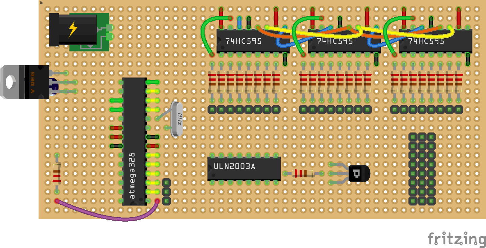
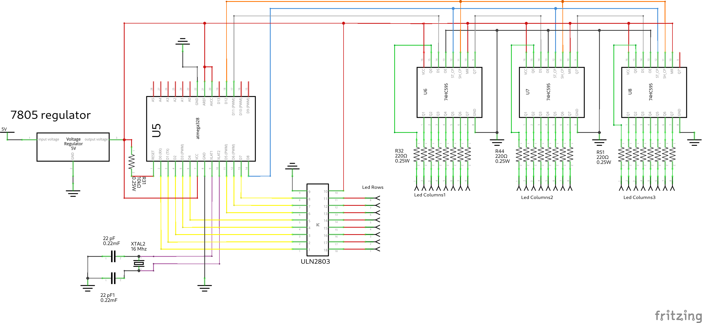

# Arduino Uno Led Matrix Project (2014)

This is a very old project of mine from 2014 ;)

It works by reflecting the buffer variable to the LEDs with Timer ISR at a specified frequency.

you can draw anything you want with set_pixel or set_screen_frame functions

- 24 x 8 resolution... 

- 3 shift registers for full row... (79HC595)

- 1 transistor array for driving leds... (ULN2003A)

- Contains various animations and sprites...

- Turkish font characters...

- Text scrolling feature...

---

**Production circuit**

**Schematic circuit**

**Demo**

